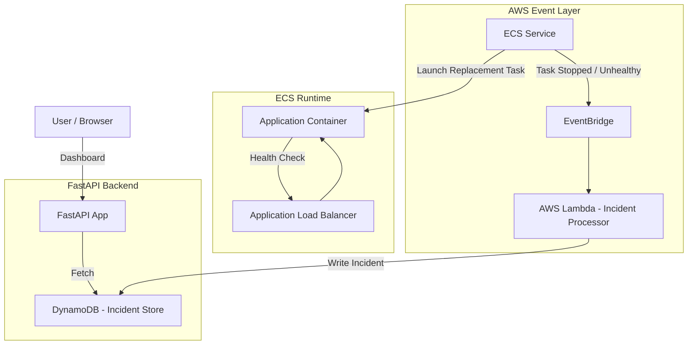

#  HealOps – AWS Cloud Reliability & Self-Healing Incident Platform

HealOps is a **cloud-native reliability and failure-observation platform** built on AWS.  
It captures real failures from ECS, stores them in DynamoDB, measures MTTR, and visualizes the entire incident lifecycle through a sleek FastAPI dashboard.

No mocks.  
No fake data.  
No simulated timestamps.  
**Everything displayed comes directly from AWS-managed events.**

---

## 🧠 What HealOps Demonstrates

### ✔️ Real ECS task failures captured automatically  
If a task stops, crashes, fails health checks, or fails deployment, AWS emits an event — HealOps records it.

### ✔️ ALB health check failures  
Unhealthy containers → ALB marks unhealthy → ECS stops task → new task launched.

### ✔️ Automatic AWS recovery  
ECS Scheduler replaces tasks instantly to maintain desired count.

### ✔️ MTTR calculated from REAL timestamps  
Detection time = EventBridge event  
Recovery time = ECS steady state  
MTTR = healed_time − detection_time

Most recoveries occur within **1–2 seconds**.

### ✔️ DynamoDB as the system of record  
Every incident is stored with structured metadata:

- incident type  
- failure reason  
- detection timestamp  
- recovery timestamp  
- MTTR  
- cluster, task ARN, exit code, etc.  

### ✔️ FastAPI dashboard  
Front-end mirrors DynamoDB in real time — no artificial UI assumptions.

---

## 🏛️ Architecture (Mermaid Diagram)

#  Project Components

### **1️⃣ ECS Fargate**
- Runs the application container  
- Integrates with ALB for health checks  
- Replaces failing tasks automatically  

### **2️⃣ ALB**
- Performs `/health` checks  
- Marks tasks unhealthy → triggers stop & replacement  

### **3️⃣ EventBridge**
Captures:
- ECS Task STOPPED  
- Health check failures  
- Deployment failures  
- Essential containers exiting  

### **4️⃣ AWS Lambda**
Lightweight ingestion engine:
- Parses ECS events  
- Classifies the incident  
- Saves record to DynamoDB  
- Identifies recovery and calculates MTTR  

### **5️⃣ DynamoDB**
Stores the entire incident history:
service, incident_type, failure_reason, detection_time,
healed_time, mttr_seconds, healing_action, cluster, task_arn…

### **6️⃣ FastAPI**
- Dashboard APIs  
- Incidents API  
- UI rendering  

### **7️⃣ Terraform IaC**
Creates all AWS infrastructure:
- VPC  
- Subnets  
- ECS Cluster  
- Task Definition  
- ALB  
- Target Group  
- EventBridge Rule  
- IAM Roles  
- DynamoDB Table  
- Lambda Function  

### **8️⃣ Jenkins CI/CD**
Build → ECR push → ECS deploy pipeline.

---

# 📊 Dashboard Screenshots (placeholders)

---

# 🛠 Incident Behavior Supported

| Failure Type | Cause | Detection | Healing |
|--------------|-------|-----------|---------|
| HEALTH_CHECK_FAILURE | ALB health check failed | EventBridge ECS event | ECS launches new task |
| DEPLOYMENT_FAILURE | Bad image / startup crash | ECS Task STOPPED | ECS rollback / new task |
| TASK_STOPPED | Manual or forced stop | ECS STOPPED event | ECS scheduler |
| CONTAINER_CRASH | Essential container exit | STOPPED | Replacement task |

Every incident includes:
- Failure reason  
- Detection time  
- Recovery time  
- MTTR  
- Healing action  

---

# 📦 Folder Structure

